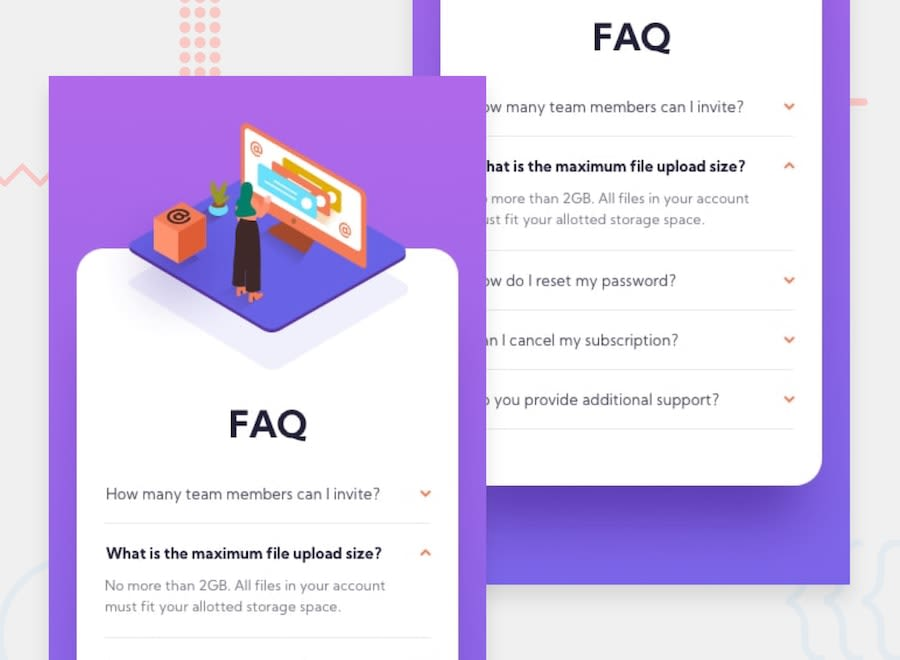

# Frontend Mentor - FAQ accordion card solution

This is a solution to the [FAQ accordion card challenge on Frontend Mentor](https://www.frontendmentor.io/challenges/faq-accordion-card-XlyjD0Oam). Frontend Mentor challenges help you improve your coding skills by building realistic projects. 

## Table of contents

- [Overview](#overview)
  - [The challenge](#the-challenge)
  - [Screenshot](#screenshot)
  - [Links](#links)
- [My process](#my-process)
  - [Built with](#built-with)
  - [What I learned](#what-i-learned)
  - [Continued development](#continued-development)
  - [Useful resources](#useful-resources)
- [Author](#author)
- [Acknowledgments](#acknowledgments)

## Overview

### The challenge

Users should be able to:

- View the optimal layout for the component depending on their device's screen size
- See hover states for all interactive elements on the page
- Hide/Show the answer to a question when the question is clicked

### Screenshot

### Links

- Solution URL: [Repo](https://github.com/sedaryildirim/FAQ-accordion-card)
- Live Site URL: [Live Site](https://sedaryildirim.github.io/FAQ-accordion-card/)

## My process

### Built with

- Semantic HTML5 markup
- CSS custom properties
- Flexbox
- CSS Grid
- Mobile-first workflow
- JS

### What I learned

how to position items with Z-Index, relative and asbolute positioning.

### Continued development

Have to work on making sites fully responsive at all screen sizes, error with floating image that needs to be fixed

### Useful resources

- [Kevin Powell](https://www.youtube.com/KevinPowell) - HTML & CSS tutorirals
- [Net Ninja](https://www.youtube.com/thenetninja) - HTML, CSS & JS tutorirals

## Author

- Github - [Sedar Yildirim](https://github.com/sedaryildirim)
- Frontend Mentor - [@sedaryildirim](https://www.frontendmentor.io/profile/sedaryildirim)

## Acknowledgments

[Frontendmentor.io](https://www.frontendmentor.io/)

[Flexboxfroggy](https://flexboxfroggy.com/)

[Kevin Powell](https://www.youtube.com/KevinPowell)